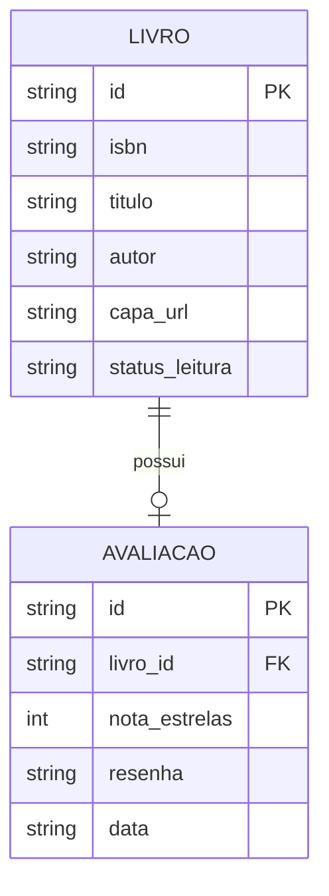

# Especificação Técnica (Architecture)

## Tecnologias Utilizadas

| Tecnologia | Uso na Aplicação |
|---|---|
| **Bootstrap 5** | Framework CSS: sistema de Grid/Flexbox responsivo e componentes (navbar, cards, modais, formulários). |
| **JavaScript Vanilla (ES6+)** | Lógica de negócio, manipulação do DOM e requisições assíncronas (`fetch`/`async`/`await`). |
| **jQuery** | Manipulação do DOM, eventos e animações. |
| **jQuery Mask Plugin** | Formatação de campos de entrada (máscara no campo ISBN). |
| **Sass (SCSS)** | Modularização do CSS com variáveis, mixins e funções. |
| **JSON Server** | API Fake para persistência das entidades Livro e Avaliação. |
| **Google Books API** | API pública real para busca automática de dados dos livros por ISBN. |
| **GitHub Pages** | Hospedagem/Deploy da aplicação (dependências via CDN). |

## APIs Consumidas

### 1. Google Books API (API Pública Real)
* **Endpoint:** `https://www.googleapis.com/books/v1/volumes?q=isbn:{isbn}`
* **Método:** `GET`
* **Tratamento de erros:** ISBN não encontrado (`totalItems === 0`), falha de rede ou limite de requisições exibem mensagem amigável ao usuário.
* **Dados extraídos:** `title`, `authors`, `imageLinks.thumbnail`.

### 2. JSON Server (API Fake)
* **Base URL:** `http://localhost:3000`

| Método | Rota | Descrição |
|---|---|---|
| `GET` | `/livros` | Lista todos os livros da estante. |
| `GET` | `/livros/{id}` | Busca um livro específico. |
| `POST` | `/livros` | Cadastra um novo livro. |
| `PUT/PATCH` | `/livros/{id}` | Atualiza status/dados de um livro. |
| `DELETE` | `/livros/{id}` | Remove um livro (e sua avaliação - RN09). |
| `GET` | `/avaliacoes?livro_id={id}` | Busca a avaliação de um livro. |
| `POST` | `/avaliacoes` | Registra nota e resenha de um livro lido. |
| `DELETE` | `/avaliacoes/{id}` | Remove uma avaliação. |

## Modelo de Dados (Diagrama Mermaid)

Abaixo está o mapeamento das entidades que serão utilizadas na API Fake (JSON Server) e como elas se relacionam. Teremos a entidade "LIVRO" e a entidade "AVALIACAO".

### Dicionário de Dados

| Entidade | Campo | Tipo | Restrição |
|---|---|---|---|
| LIVRO | `id` | string | Chave primária (uuid). |
| LIVRO | `isbn` | string | Obrigatório. Regex: 10 ou 13 dígitos numéricos. Único na estante (RN03). |
| LIVRO | `titulo` | string | Obrigatório, 2–100 caracteres. |
| LIVRO | `autor` | string | Obrigatório, 2–100 caracteres. |
| LIVRO | `capa_url` | string | URL da imagem de capa (Google Books ou placeholder). |
| LIVRO | `status_leitura` | string | Enum: `quero-ler` \| `lendo` \| `lido` (RN02). |
| AVALIACAO | `id` | string | Chave primária (uuid). |
| AVALIACAO | `livro_id` | string | Chave estrangeira → `LIVRO.id`. Relação 1:1 (RN07). |
| AVALIACAO | `nota_estrelas` | int | Entre 1 e 5 (RN06). |
| AVALIACAO | `resenha` | string | Texto livre, até 500 caracteres. |
| AVALIACAO | `data` | string | Data da avaliação (`ISO 8601`). |

## Design Tokens

Tokens definidos a partir do protótipo (Stitch/Figma) e aplicados em toda a aplicação via variáveis Sass/CSS.

### Cores

| Token | Valor | Uso |
|---|---|---|
| `$color-primary` | `#4E342E` | Cor principal (marrom café) - navbar, botões primários. |
| `$color-primary-light` | `#6D4C41` | Hover/estados ativos. |
| `$color-secondary` | `#8D6E63` | Detalhes, ícones e links. |
| `$color-accent` | `#FBC02D` | Destaque: estrelas de avaliação e badges "Lendo". |
| `$color-background` | `#FAF7F2` | Fundo geral das páginas (papel). |
| `$color-surface` | `#FFFFFF` | Fundo de cards e modais. |
| `$color-success` | `#388E3C` | Badge "Lido" e mensagens de sucesso. |
| `$color-info` | `#1976D2` | Badge "Lendo" e mensagens informativas. |
| `$color-danger` | `#D32F2F` | Mensagens de erro e validações. |
| `$color-text` | `#212121` | Texto padrão. |
| `$color-text-muted` | `#757575` | Texto secundário. |

### Tipografia

| Token | Valor |
|---|---|
| `$font-family-base` | `"Roboto", sans-serif` |
| `$font-family-title` | `"Playfair Display", serif` |
| `$font-size-base` | `clamp(0.95rem, 0.9rem + 0.35vw, 1.15rem)` (tipografia fluida - ID 08) |
| `$font-size-h1` | `clamp(1.8rem, 1.5rem + 1.5vw, 2.75rem)` |
| `$font-size-h2` | `clamp(1.4rem, 1.25rem + 1vw, 2rem)` |

### Espaçamento e Raios

| Token | Valor |
|---|---|
| `$spacing-unit` | `0.5rem` (escala: 1x, 2x, 3x, 4x) |
| `$border-radius` | `0.75rem` |
| `$card-shadow` | `0 0.25rem 0.75rem rgba(78, 52, 46, 0.15)` |

> As unidades do layout são relativas (`rem`, `%`, `vh`, `clamp()`) para garantir fluidez (ID 05).
