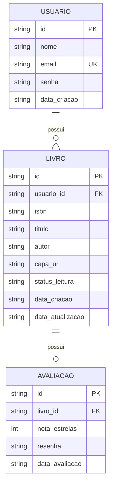

# Software Design Document / Architecture

## 1. Visão Técnica

O **BookTracker** será uma aplicação web responsiva desenvolvida com HTML5, CSS/Sass e JavaScript ES6+, usando **Bootstrap 5.3.8** como Framework CSS principal.

Arquitetura-alvo:

- páginas HTML separadas;
- JavaScript modular por responsabilidade;
- Bootstrap para Grid, Flexbox, utilitários e componentes;
- Sass/CSS próprio para identidade visual;
- JSON Server como API fake acadêmica;
- Google Books API v1 para busca por ISBN;
- Web Storage para sessão acadêmica e preferências;
- GitHub Pages para hospedagem estática da interface final.

A autenticação é **didática**, construída sobre a API fake exigida pela disciplina. Não deve ser apresentada como autenticação segura de produção.

## 2. Páginas Principais

### 2.1 Login — `login.html`

Responsabilidades:

- validar e-mail e senha;
- consultar usuário na API fake;
- iniciar sessão acadêmica;
- direcionar para Cadastro.

### 2.2 Cadastro — `cadastro.html`

Responsabilidades:

- validar nome, e-mail, senha e confirmação;
- impedir e-mail duplicado;
- criar usuário;
- iniciar fluxo autenticado ou direcionar para Login.

### 2.3 Estante — `index.html`

Responsabilidades:

- exigir sessão válida;
- carregar somente livros do usuário atual;
- renderizar cards;
- buscar por título/autor;
- filtrar por status;
- ordenar;
- exibir estado vazio;
- restaurar preferências;
- direcionar para Adicionar Livro e Detalhes.

### 2.4 Adicionar/Editar Livro — `livro-form.html`

Esta página é **reutilizada em dois modos**.

#### Modo Adicionar

- campos inicialmente vazios;
- busca por ISBN;
- preenchimento automático por Google Books;
- fallback manual;
- seleção de status;
- ação principal `Salvar livro`.

#### Modo Editar

- carregar o livro atual;
- preencher ISBN, título, autor(es), status e preview de capa;
- permitir alterar ISBN, título, autor(es) e status;
- permitir nova busca por ISBN;
- atualizar a capa somente a partir da Google Books API/fallback;
- ação principal `Salvar alterações`;
- cancelar retorna ao Detalhes sem persistir mudanças;
- salvar retorna ao Detalhes atualizado.

> Não existem páginas/telas separadas M4B/D4B. M4/D4 representam o mesmo formulário em contextos diferentes.

> Avaliação e resenha não pertencem ao formulário de livro. Elas são gerenciadas nos Detalhes.

### 2.5 Detalhes — `livro.html`

Responsabilidades:

- exibir livro do usuário atual;
- mostrar capa, título, autor, ISBN e status;
- abrir o formulário em modo Editar;
- excluir livro com confirmação;
- criar/editar avaliação quando status for Lido;
- informar indisponibilidade de avaliação para livros não concluídos.

## 3. Modelo de Dados

A API fake terá três entidades principais: **USUARIO**, **LIVRO** e **AVALIACAO**.


```mermaid
erDiagram
    USUARIO ||--o{ LIVRO : possui
    LIVRO ||--o| AVALIACAO : possui

    USUARIO {
        string id PK
        string nome
        string email UK
        string senha
        string data_criacao
    }

    LIVRO {
        string id PK
        string usuario_id FK
        string isbn
        string titulo
        string autor
        string capa_url
        string status_leitura
        string data_criacao
        string data_atualizacao
    }

    AVALIACAO {
        string id PK
        string livro_id FK
        int nota_estrelas
        string resenha
        string data_avaliacao
    }
```

### Regras relacionais

- um usuário possui zero ou muitos livros;
- cada livro pertence a exatamente um usuário;
- ISBN é único dentro da estante do mesmo usuário;
- cada livro possui no máximo uma avaliação;
- somente livro `lido` pode possuir avaliação;
- excluir livro remove também a avaliação associada via lógica JavaScript.

### Credenciais de demonstração

JSON Server não fornece autenticação real, hashing seguro, autorização no servidor ou sessão protegida.

Portanto:

- usar somente credenciais fictícias;
- nunca reutilizar senha pessoal;
- não afirmar segurança de produção;
- nunca guardar senha em `localStorage` ou `sessionStorage`.

## 4. API Fake

Base local:

`http://localhost:3000`

### Usuários

| Método | Rota | Uso |
|---|---|---|
| GET | `/usuarios?email={email}` | localizar conta/verificar duplicidade |
| POST | `/usuarios` | criar usuário |
| GET | `/usuarios/{id}` | recuperar usuário da sessão quando necessário |

### Livros

| Método | Rota | Uso |
|---|---|---|
| GET | `/livros?usuario_id={id}` | listar estante |
| GET | `/livros/{id}` | carregar livro |
| GET | `/livros?usuario_id={id}&isbn={isbn}` | verificar duplicidade |
| POST | `/livros` | adicionar |
| PATCH | `/livros/{id}` | salvar alterações |
| DELETE | `/livros/{id}` | excluir |

### Avaliações

| Método | Rota | Uso |
|---|---|---|
| GET | `/avaliacoes?livro_id={id}` | consultar |
| POST | `/avaliacoes` | criar |
| PATCH | `/avaliacoes/{id}` | editar |
| DELETE | `/avaliacoes/{id}` | excluir |

> O front-end deve verificar que o livro carregado pertence ao usuário da sessão antes de permitir ações. Isso é apenas uma proteção didática no cliente, não autorização segura de backend.

## 5. Sessão e Web Storage

### Sessão acadêmica

Preferência: `sessionStorage`.

Chave:

`booktracker.session.userId`

Fluxo:

1. Login válido define o `userId`;
2. páginas protegidas verificam a chave;
3. ausência de sessão redireciona para Login;
4. dados são filtrados pelo `usuario_id`;
5. encerrar sessão remove a chave.

Nenhuma senha é armazenada no Web Storage.

### Preferências

`localStorage` pode armazenar:

- filtro de status;
- ordenação;
- busca textual, se adotada.

## 6. Google Books API

Consulta prevista:

`GET https://www.googleapis.com/books/v1/volumes?q=isbn:{isbn}`

Campos principais:

- `volumeInfo.title`;
- `volumeInfo.authors`;
- `volumeInfo.imageLinks.thumbnail`.

Comportamento:

- resultado encontrado → preencher/sugerir dados;
- sem resultado → manter entrada manual;
- sem capa → fallback local;
- falha → feedback sem apagar campos;
- nova busca no modo Editar pode atualizar título, autoria e capa antes do salvamento.

A capa não terá upload manual.

## 7. Estrutura Planejada

```text
/
├── login.html
├── cadastro.html
├── index.html
├── livro-form.html
├── livro.html
├── db.json
├── package.json
├── README.md
├── docs/
└── src/
    ├── js/
    │   ├── api/
    │   │   ├── auth-api.js
    │   │   ├── google-books-api.js
    │   │   └── library-api.js
    │   ├── pages/
    │   │   ├── login.js
    │   │   ├── cadastro.js
    │   │   ├── estante.js
    │   │   ├── livro-form.js
    │   │   └── livro-detalhe.js
    │   ├── session.js
    │   ├── storage.js
    │   ├── validation.js
    │   └── ui.js
    ├── scss/
    │   ├── _tokens.scss
    │   ├── _components.scss
    │   ├── _utilities.scss
    │   └── main.scss
    └── assets/
        └── images/
```

## 8. Design System

### Conceito

**Biblioteca pessoal contemporânea**: editorial, limpa, acolhedora, moderna e reproduzível com Bootstrap 5.3 + Sass.

### Tokens

| Token | Valor | Uso |
|---|---|---|
| Primary | `#3F5144` | identidade e CTA principal |
| Primary dark | `#2C3A30` | hover/ênfase |
| Accent | `#C47A4A` | acentos e estrelas |
| Background | `#F5F3EE` | fundo geral |
| Surface | `#FFFFFF` | cards/formulários/modais |
| Text | `#20231F` | texto principal |
| Muted | `#62685F` | texto secundário |
| Border | `#D9DDD6` | divisórias/campos |
| Success | `#2F7D4A` | sucesso/Lido |
| Info | `#3F6F8E` | informação/Lendo |
| Warning | `#A56A22` | atenção/Quero ler |
| Danger | `#B4423C` | erro/exclusão |

Tipografia:

- títulos: **DM Serif Display**;
- corpo/interface: **Inter**.

### Princípios

- ritmo de espaçamento baseado em 8 px;
- controles com raio aproximado de 12–16 px;
- cards com raio aproximado de 16–20 px;
- sombras discretas;
- capas em proporção consistente;
- alvos de toque confortáveis;
- terracota como acento, não como CTA principal.

## 9. Mapeamento para Bootstrap 5.3

O Design System/protótipo deve permitir identificar visualmente, no mínimo:

1. **Navbar / Offcanvas** — navegação;
2. **Card** — livro da estante;
3. **Modal** — confirmação de exclusão.

Também serão usados:

- Forms;
- Input Group;
- Buttons;
- Badges;
- Alert/Toast;
- Select/Dropdown.

Essas identificações pertencem ao contrato de protótipo; as classes reais serão comprovadas apenas na fase de implementação.

## 10. Responsividade

Estratégia mobile-first:

- xs: uma coluna e navegação compacta;
- sm/md: reorganização de filtros e formulários;
- lg+: grade de múltiplos cards e formulários/detalhes com melhor uso horizontal.

Combinar:

- Grid/Flexbox Bootstrap;
- CSS Grid/Flexbox próprio quando apropriado;
- unidades relativas;
- tipografia fluida com `clamp()`;
- imagens responsivas e `object-fit`.

## 11. Acessibilidade — Requisitos de Implementação

O protótipo define a intenção visual; o código ainda deverá comprovar:

- HTML semântico;
- labels associados aos controles;
- mensagens de erro junto aos campos;
- navegação por teclado;
- foco visível;
- contraste suficiente;
- texto alternativo;
- status não dependentes apenas de cor;
- foco adequado em Modal/Offcanvas;
- suporte a `prefers-reduced-motion` em animações customizadas.

Não considerar ARIA, classes Bootstrap ou contraste medido como implementados antes de existirem/serem validados no código.

## 12. Regra de Avaliação

- `lido` com avaliação → mostrar estrelas correspondentes;
- `lido` sem avaliação → `Ainda não avaliado`;
- `lendo` e `quero-ler` → sem estrelas falsas;
- estrelas/resenha aparecem somente nos Detalhes;
- formulário M4/D4 não contém avaliação;
- ao mudar um livro avaliado de `lido` para outro status, solicitar confirmação antes de remover a avaliação incompatível.

## 13. Protótipo Final Aprovado

Somente frames **APPROVED** fazem parte do contrato.

### Design System

- APPROVED DESIGN SYSTEM

### Mobile

- APPROVED M0A — Login
- APPROVED M0B — Cadastro
- APPROVED M1 — Minha Estante
- APPROVED M2 — Estante Vazia
- APPROVED M3 — Offcanvas
- APPROVED M4 — Adicionar/Editar Livro
- APPROVED M5 — Validação e API
- APPROVED M6 — Detalhes Lido
- APPROVED M7 — Detalhes Não Concluído
- APPROVED M8 — Modal de Exclusão
- APPROVED M9 — Feedback e Loading

### Desktop

- APPROVED D0A — Login
- APPROVED D0B — Cadastro
- APPROVED D1 — Minha Estante
- APPROVED D2 — Estante Vazia
- APPROVED D4 — Adicionar/Editar Livro
- APPROVED D5 — Validação e API
- APPROVED D6 — Detalhes Lido
- APPROVED D7 — Detalhes Não Concluído
- APPROVED D8 — Modal de Exclusão

### Regra de inventário

- não criar M4B/D4B;
- M4/D4 atendem Adicionar e Editar;
- estados de erro/loading/modal não viram páginas independentes;
- versões antigas/exploratórias do Stitch não fazem parte da implementação.

## 14. Fluxos de Navegação

### Mobile

`M0A Login ↔ M0B Cadastro → M1 Estante`

`M1 → M3 Offcanvas → M1/M4`

`M1 → M4 (Adicionar) → M9 → M1`

`M1 → M6/M7 Detalhes`

`M6/M7 → M4 (Editar preenchido) → M6/M7 atualizado`

`M4 Editar → Cancelar → Detalhes sem alteração`

`M6/M7 → M8 Excluir → Detalhes ou M1`

### Desktop

`D0A Login ↔ D0B Cadastro → D1 Estante`

`D1 → D4 (Adicionar) → D1`

`D1 → D6/D7 Detalhes`

`D6/D7 → D4 (Editar preenchido) → D6/D7 atualizado`

`D4 Editar → Cancelar → Detalhes sem alteração`

`D6/D7 → D8 Excluir → Detalhes ou D1`

## 15. Fora do Escopo

Não adicionar:

- perfil/avatar;
- OAuth/login social;
- coleções;
- citações/notas pessoais;
- diário;
- metas/streaks;
- progresso/páginas;
- número de páginas;
- formato;
- editora;
- ano/data de edição/publicação;
- upload manual de capa;
- rede social;
- recomendações;
- dashboard/estatísticas.

## 16. Restrições Técnicas

- Tailwind CSS não será usado;
- não haverá React/Vue;
- lógica principal em JavaScript Vanilla ES6+;
- Bootstrap será o Framework CSS oficial;
- o projeto deve permanecer simples o suficiente para ser explicado durante a avaliação.


## 17. Compatibilidade com as Atividades da Disciplina

O desenvolvimento deve seguir também o [Roadmap da Disciplina](course-roadmap.md).

### Atividade 07

Quando o código Bootstrap for iniciado, preservar evidências de:

- Grid responsivo;
- colunas automáticas e `.col-12`;
- classes `.col-md-*`;
- offset e order;
- utilidades responsivas de display;
- Modal;
- Card;
- utilidades de texto;
- Flexbox;
- Bootstrap Icons.

Requisitos didáticos muito específicos que não se encaixem naturalmente no produto podem ser demonstrados em uma página/laboratório da atividade, sem deformar as telas finais do BookTracker.

### Atividade 08

A conversão do protótipo APPROVED para código deverá permitir auditoria clara de pelo menos dez componentes Bootstrap. O conjunto planejado é:

1. Navbar;
2. Offcanvas;
3. Card;
4. Modal;
5. Button;
6. Badge;
7. Input Group;
8. Alert;
9. Toast;
10. Spinner.

Form Controls e Form Select também serão utilizados e podem compor a lista final conforme o código realmente implementado.

A aplicação também deverá possuir **Sticky Footer**, preferencialmente com uma estrutura flex vertical baseada em classes/utilitários equivalentes a `min-vh-100`, `flex-grow-1` e/ou `mt-auto`, desde que a implementação final seja auditada e explicável.

A responsividade deverá ser testada nos breakpoints xs, sm, md, lg, xl e xxl, incluindo verificação de overflow, proporção das imagens e funcionamento do Offcanvas.

### Bootstrap local e deploy

- durante a Atividade 08, Bootstrap deve ser consumido a partir da instalação NPM local para comprovar o uso de `node_modules`;
- no deploy final, seguir a orientação específica da disciplina para GitHub Pages, inclusive CDN quando solicitado;
- as evidências de uma fase não devem ser confundidas com as exigências da outra.
